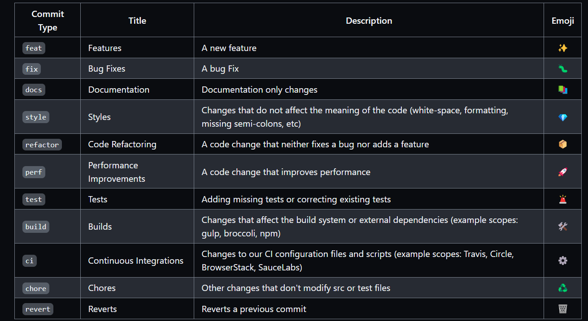

# Web Application Development

## Contents

- [Git Commit types](#git-commit-types)
- [Introduction to Svelte](#create-svelte)
- [Handy/Important links for development](#handy--important-links-for-development)

## Git commit types

For this project
the [Git Conventional commits](https://github.com/pvdlg/conventional-commit-types/blob/master/README.md) will be used
when writing commits, see below for an short overview



## Create-svelte

Everything you need to build a Svelte project, powered
by [`create-svelte`](https://github.com/sveltejs/kit/tree/main/packages/create-svelte).

### Creating a project

If you're seeing this, you've probably already done this step. Congrats!

```bash
# create a new project in the current directory
npm create svelte@latest

# create a new project in my-app
npm create svelte@latest my-app
```

### Developing

Once you've created a project and installed dependencies with `npm install` (or `pnpm install` or `yarn`), start a
development server:

```bash
npm run dev

# or start the server and open the app in a new browser tab
npm run dev -- --open
```

> IF YOU CAN'T USE _NPM RUN DEV_ BECAUSE OF PERMISSION ERRORS USE THE FOLLOWING COMMANDS:
>
> Run the ```update``` in the [package.json](package.json) or use the command ```npm run update``` in the terminal
>
> You will need to rerun this everytime you make changes, since you are not in developing view but in build

### Building

To create a production version of your app:

```bash
npm run build
```

You can preview the production build with `npm run preview`.

> To deploy your app, you may need to install an [adapter](https://kit.svelte.dev/docs/adapters) for your target
> environment.

## Handy & Important links for development

Under here follows a list of links with stuff that are being used during development, for example colour palette(s) or
components like buttons that someone else developed:

- [Current default colour palette](https://coolors.co/palette/0a1128-001f54-034078-1282a2-fefcfb), see also the
  file [tailwind.config.js](tailwind.config.js)
  for which names are given to the colours in this palette
- [Design project in Figma](https://www.figma.com/design/1j8D9DgrVxbRDGJTXntrYx/WineDrinkers-Web?node-id=0-1&t=Nagb5rrIeB9q9y3u-1)
, the link for the design project in Figma for this website. Please use a new frame per page instead of the figma pages.

